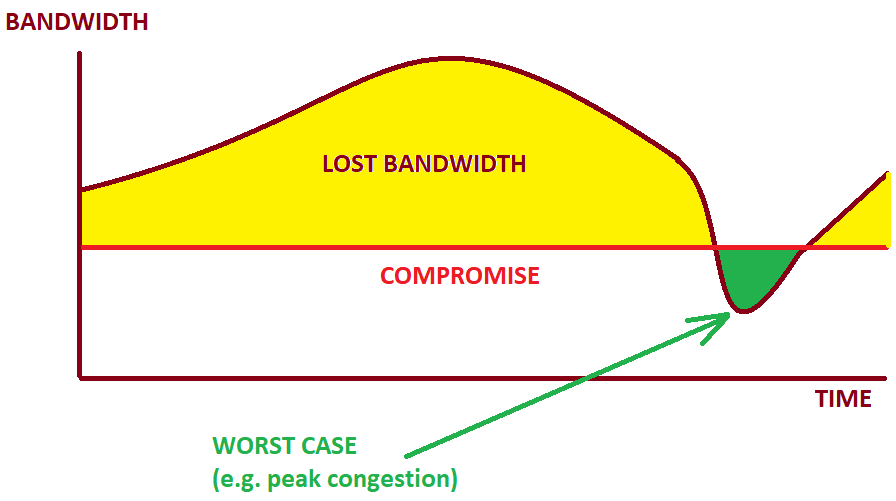
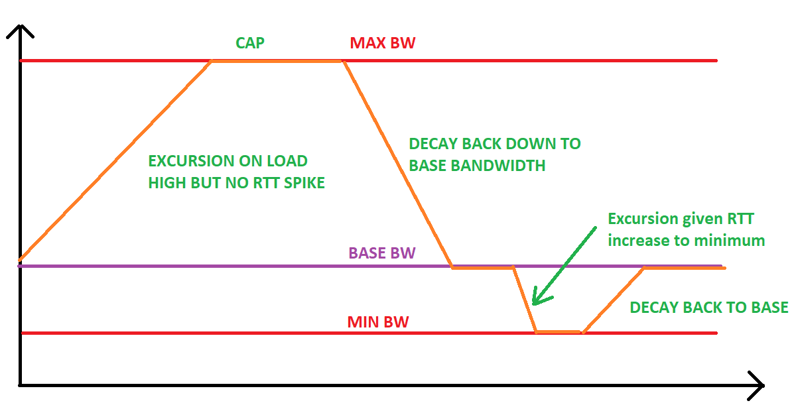
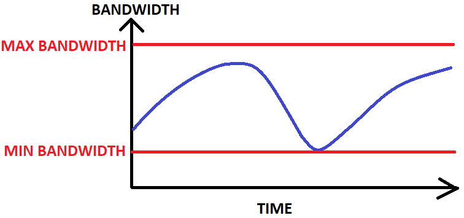

# CAKE with Adaptive Bandwidth - "autorate"

**CAKE-autorate** is a script that automatically adapts [CAKE Smart Queue Management (SQM)](https://www.bufferbloat.net/projects/codel/wiki/Cake/) bandwidth settings by measuring traffic load and RTT times. This is designed for variable bandwidth connections such as LTE, and is not intended for use on connections that have a stable, fixed bandwidth.

CAKE is an algorithm that manages the buffering of data being sent/received by a device such as an [OpenWrt router](https://openwrt.org) so that no more data is queued than is necessary, minimizing the latency ("bufferbloat") and improving the responsiveness of a network.

Present version is 2.0.0 - please see [the changelog](CHANGELOG.md) for details. 

## The Problem: CAKE on Variable Connections forces an Unpalatable Compromise

The CAKE algorithm always uses fixed upload and download bandwidth settings to manage its queues. Variable bandwidth connections present a challenge because the actual bandwidth at any given moment is not known. 

As CAKE works with a fixed set bandwidth this effectively forces the user to choose a compromise bandwidth setting, but typically this means lost bandwidth in exchange for latency control and/or bufferbloat during the worst conditions. This compromise is hardly ideal: whilst the actual usable line rate is above the set compromise bandwidth, the connection is unnecessarily throttled back to the compromise setting resulting in lost bandwidth (yellow); and whilst the actual usable line rate is below the compromise value, the connection is not throttled enough (green) resulting in bufferbloat.



## The Solution: Automatic Bandwidth Adjustment based on LOAD and RTT

The **cake-autorate.sh** script periodically measures the load and Round-Trip-Time (RTT) to adjust the upload and download values for the CAKE algorithm.

## Theory of Operation

`cake-autorate.sh` monitors load (rx and tx) and ping respones from one or more reflectors, and adjusts the download and upload bandwidth for CAKE. Rate control is intentionally kept as simple as possible and follows the following approach:

- with low load, decay rate back to set baseline (and subject to refractory period)
- with high load, increase rate subject to set maximum
- on bufferbloat, decrease rate subject to set min (and subject to refractory period)



**Setting the minimum bandwidth:** 
Set the minimum value to the worst possible observed bufferbloat free bandwidth. Ideally this CAKE bandwidth should never result in bufferbloat even under the worst conditions. This is a hard minimum - the script will never reduce the bandwidth below this level.

**Setting the baseline bandwidth:** 
This is the steady state bandwidth to be maintained under no or low load. This is likely the compromise bandwidth described above, i.e. the value you would set CAKE to that is bufferbloat free most, but not necessarily all, of the time. 

**Setting the maximum bandwidth:** 
The maximum bandwidth should be set to the lower of the maximum bandwidth that the ISP can provide or the maximum bandwidth required by the user. The script will adjust the bandwidth up when there is traffic, as long no RTT spike is detected. Setting this value to a maximum required level will have the advantage that the script will stay at that level during optimum conditions rather than always having to test whether the bandwidth can be increased (which necessarily results in allowing some excess latency through).

To elaborate on setting the minimum and maximum, a variable bandwidth connection may be most ideally divided up into a known fixed, stable component, on top of which is provided an unknown variable component:



The minimum bandwidth is then set to (or slightly below) the fixed component, and the maximum bandwidth may be set to (or slightly above) the maximum observed bandwidth. Or, if a lower maximum bandwidth is required by the user, the maximum bandwidth is set to that lower bandwidth as explained above.

The baseline bandwidth is likely optimally either the minimum bandwidth or somewhere close thereto (e.g. the compromise bandwidth). 

There is a detailed and fun discussion with plenty of sketches relating to the development of the script and alternatives on the
[OpenWrt Forum - CAKE /w Adaptive Bandwidth.](https://forum.openwrt.org/t/cake-w-adaptive-bandwidth/108848/312)

## Required packages

Only requires:

- **bash** for its builtins, arithmetic and array handling

A pinger binary chosen from:

- **fping** round robin pinging to multiple reflectors with tightly controlled timings (default selection)
- **iputils-ping** advanced pinging than the default busybox ping with sub 1s ping frequency

The pinger binary that cake-autorate uses is set using the $pinger_binary variable in the config file. 

## Installation on OpenWrt

- Install SQM (`luci-app-sqm`) and enable CAKE on the interface(s)
as described in the
[OpenWrt SQM documentation](https://openwrt.org/docs/guide-user/network/traffic-shaping/sqm)
- Alternatively, and if you want to work with DSCPs, consider [cake-simple-qos](https://github.com/lynxthecat/cake-qos-simple) or for unusual setups such as those with WireGuard with PBR, then you may want to consider [cake-dual-ifb](https://github.com/lynxthecat/cake-dual-ifb).
- [SSH into the router](https://openwrt.org/docs/guide-quick-start/sshadministration)
- It is recommended to install cake-autorate using the installer script from this repo, e.g. by copying and pasting each of the commands below:

   ```bash
   wget -O /tmp/cake-autorate_setup.sh https://raw.githubusercontent.com/lynxthecat/CAKE-autorate/master/cake-autorate_setup.sh
   sh /tmp/cake-autorate_setup.sh
   ```
- The installer script will detect a previous configuration file, and ask whether to preserve it. If you do not keep it...
- Edit the `cake-autorate-config.primary.sh` script (in the `/root/cake-autorate` directory) using vi or nano to set the configuration parameters below (see comments inside `cake-autorate-config.sh` for details). 

  - Change `ul_if` and `dl_if` to match the names of the upload and download interfaces to which CAKE is applied. These can be obtained, for example, by consulting the configured SQM settings in LuCi or by examining the output of `tc qdisc ls`.

      | Variable | Setting | 
      |----: |   :-------- | 
      | `ul_if` | Interface that uploads (often `wan`) |
      | `dl_if` | Interface that uploads data (check `tc qdisc ls`) |

  - Choose whether to have cake-autorate actually adjust the shaper rates (disable for monitoring only):
  
      | Variable | Setting | 
      |----: |   :-------- | 
      | `adjust_dl_shaper_rate` | enable (1) or disable (0) actually changing the dl_shaper_rate | 
      | `adjust_ul_shaper_rate` | enable (1) or disable (0) actually changing the dl_shaper_rate |

  - Set bandwidth variables as described in `cake-autorate-config.sh`.
 
      | Type | Download | Upload |
      |----: |   :-------- | :------ |
      | Min. | `min_dl_shaper_rate_kbps` | `min_ul_shaper_rate_kbps` |
      | Base | `base_dl_shaper_rate_kbps` | `base_ul_shaper_rate_kbps` |
      | Max. | `max_dl_shaper_rate_kbps` | `max_ul_shaper_rate_kbps` |
      
  - Set any further overrides by inspecting 'cake-autorate_defaults.sh' and setting different values for any of the defaults. For example, to set a different dl_delay_thr_ms, then add a line to the config like:
  
  ```
  dl_delay_thr_ms=100
  ```
  
  - The following variables control logging:

      | Variable | Setting | 
      |----: |   :-------- | 
      | `output_processing_stats` | If non-zero, log the results of every iteration through the process | 
      | `output_cake_changes` | If non-zero, log when changes are made to CAKE settings via `tc` - this shows when CAKE-autorate is adjusting the shaper |
      | `debug` | If non-zero, debug lines will be output |
      | `log_to_file` | If non-zero, log lines will be sent to /tmp/cake-autorate.log regardless of whether printing to console and after every write the log file will be rotated f either `log_file_max_time_mins` have elapsed or `log_file_max_size_KB` has been exceeded |
      | `log_file_max_time_mins` | Number of minutes to elapse between log file rotaton |
      | `log_file_max_size_KB` | Number of KB (i.e. bytes/1024) worth of log lines between log file rotations |
  
## Extracting and plotting logs ##

A compressed log file can be extracted from a running cake-autorate instance using:

```bash
kill -USR1 $(cat /var/run/cake-autorate/*/proc_state | grep -E '^maintain_log_file=' | cut -d= -f2)
```

This will place a compressed log file in /var/log with the date and time in its filename

And a very helpful summary plot like this: 


can be created therefrom using the excellent Octave/Matlab utility put together by @moeller0 of OpenWrt, using something like:
 
 ```bash
 octave -qf --eval 'fn_parse_autorate_log("./log.gz", "./output.pdf")'
```
(see the introductory notes in 'fn_parse_autorate_log.m' for more details).

Here is an example script to extract the log from the router and generate the pdfs for viewing from a client machine:

```bash
ssh root@192.168.1.1 'kill -USR1 $( cat /var/run/cake-autorate/*/maintain_log_file_pid )'  && sleep 5 && scp  root@192.168.1.1:/var/log/cake-autorate*.log.gz . && ssh root@192.168.1.1 'rm /var/log/cake-autorate*.log.gz'
octave -qf --eval 'fn_parse_autorate_log("./*primary*log.gz", "./output.pdf")'
```

## Multi-Wan Setups

- cake-autorate has been designed to run multiple instances simultaneously. 
- cake-autorate will run one instance per config file present in the /root/cake-autorate/ directory in the form:

```
cake-autorate_config.interface.sh
```

where 'interface' is replaced with e.g. 'primary', 'secondary', etc.

## Example Starlink Configuration

- OpenWrt forum member @gba has kindly shared [his Starlink config](Example_Starlink_config.sh).
  This ought to provide some helpful pointers for adding appropriate overrides for Starlink users.
- See discussion on OpenWrt thread from [around this post](https://forum.openwrt.org/t/cake-w-adaptive-bandwidth/108848/3100?u=lynx).

## Manual testing

To run the `cake-autorate.sh` script:

- run:

   ```bash
   cd /root/cake-autorate # to the cake-autorate directory
   ./cake-autorate.sh
   ```

- Monitor the script output to see how it adjusts the download and upload rates as you use the connection.
- Press ^C to halt the process.

## Install as a service

You can install this as a service that starts up the autorate process whenever the router reboots.
To do this:

- [SSH into the router](https://openwrt.org/docs/guide-quick-start/sshadministration)
- Run these commands to enable and start the service file:

   ```bash
   # the cake-autorate-setup.sh script already installed the service file
   service cake-autorate enable
   service cake-autorate start
   ```

When running as a service, the `cake-autorate.sh` script outputs to `/var/log/cake-autorate.primary.log` (in dependence upon the the instance identifier 'cake-autorate_config.identifier.sh` set in the config file name). 

WARNING: Take care to ensure sufficient free memory exists in router to handle selected logging parameters.

## Preserving CAKE-autorate files for backup or upgrades

The [Backup and Restore page on the wiki](https://openwrt.org/docs/guide-user/troubleshooting/backup_restore#customize_and_verify)
describes how files can be saved across upgrades. 

[Add these files on the **Configuration** tab](https://openwrt.org/docs/guide-user/troubleshooting/backup_restore#back_up),
so they will be saved in backups and preserved across snapshot upgrades.

 ```
/root/cake-autorate
/etc/init.d/cake-autorate
 ```
  
## A Request to Testers

If you use this script I have just one ask. Please post your experience on this [OpenWrt Forum thread](https://forum.openwrt.org/t/cake-w-adaptive-bandwidth/135379/). Your feedback will help improve the script for the benefit of others.  
